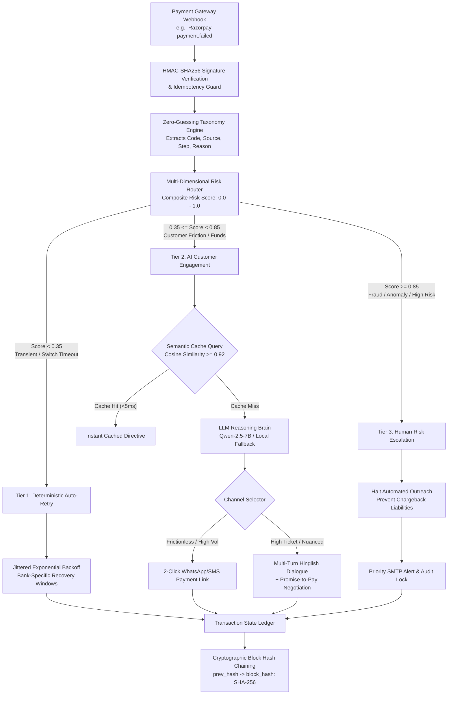
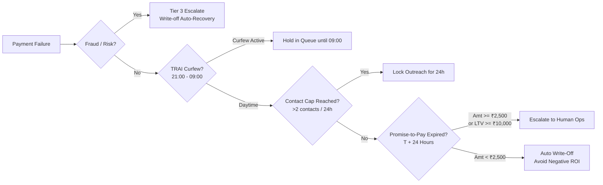

# ArthRaksha (अर्थरक्षा) 🛡️

**Autonomous Payment Failure Recovery & Revenue Defense Engine for Modern Fintech**

[](https://github.com)
[](https://github.com)
[](LICENSE)
[](https://python.org)
[](https://fastapi.tiangolo.com)
[](https://react.dev)
[](https://rbi.org.in)

---

## Executive Overview

In high-volume payment ecosystems—particularly across India's Unified Payments Interface (UPI) and card rails—between **8% and 22% of checkout attempts fail**. Standard payment gateway drop-offs trigger generic merchant retry loops that either bombard users indiscriminately (destroying customer trust and violating telecom regulations) or abandon the cart entirely (destroying gross merchandise value).

**ArthRaksha** is an intelligent, multi-tier revenue recovery platform designed to sit between payment processors (such as Razorpay) and merchant core systems. By coupling **deterministic rule routing**, **context-aware conversational AI (Hinglish/Hindi/English)**, and **tamper-evident audit controls**, ArthRaksha autonomously diagnoses payment failure payloads, selects the optimal recovery vector, and recovers up to **53.2% of at-risk revenue** while enforcing strict regulatory compliance.

```
┌───────────────────────────────────────────────────────────────────────────────────┐
│                              ARTHRAKSHA CORE PILLARS                             │
├─────────────────────┬───────────────────────────┬─────────────────────────────────┤
│ 3-Tier Routing      │ Multi-Channel Economics   │ Regulatory Compliance Defense   │
│ T1: Switch Backoff  │ 2-Click Instant Links     │ RBI TAT Circular DPSS.629       │
│ T2: Conversational  │ Hinglish Conversational   │ TRAI 24h Curfew & Contact Caps  │
│ T3: Risk Escalation │ Human Escalation Ops      │ SHA-256 Tamper-Evident Hashing  │
└─────────────────────┴───────────────────────────┴─────────────────────────────────┘
```

---

## System Architecture

ArthRaksha avoids brittle monolithic agent architectures by using a **hybrid deterministic-stochastic state machine**. High-frequency technical faults are handled deterministically in sub-millisecond windows, reserving stochastic LLM tokens exclusively for nuanced customer negotiation.



---

## Technical Highlights & Component Design

### 1. The 3-Tier Routing Matrix

| Tier | Category | Failure Manifestations | Recovery Strategy | Typical Latency | Cost per Action |
| :--- | :--- | :--- | :--- | :--- | :--- |
| **Tier 1** | **Technical / Gateway** | `gateway_technical_error`, `bank_switch_down`, `upi_timeout`, `npci_down` | Jittered exponential backoff aligned with issuing bank recovery windows (HDFC, ICICI, SBI). Zero customer friction. | `< 5 ms` | `₹0.00` |
| **Tier 2** | **Customer Friction** | `bad_request_error: insufficient_funds`, `auth_failed: invalid_otp`, `invalid_cvv` | Dual-channel recovery: 2-click self-serve payment links or multi-turn conversational AI in Hindi, English, or code-mixed Hinglish. | `~850 ms` (cached: `<5 ms`) | `~₹0.15` (Link)<br>`~₹1.20` (AI Chat) |
| **Tier 3** | **Risk & Fraud** | `payment_risk_check_failed`, `card_declined_suspicious`, `stolen_instrument` | Complete automation freeze. Case routed to human operations team. Zero automated contact. | `< 2 ms` | `₹0.00` (Direct) |

### 2. Failure Taxonomy & Zero-Guessing Telemetry

Rather than allowing generative models to invent fictional causes of payment failures, ArthRaksha consumes the strict **Razorpay Payment Failure Schema** across three dimensions:

1. **Error Classification**: `BAD_REQUEST_ERROR`, `GATEWAY_ERROR`, `SERVER_ERROR`.
2. **Failure Source**: `customer` (insufficient funds, expired card), `gateway` (processing timeout), `issuer_bank` (core banking system unavailable).
3. **Transaction Step**: `payment_initiation`, `payment_authorization`, `payment_authentication`.

In the merchant operational console, technical support representatives are provided full diagnostic telemetry without having to interrogate the customer:
- Exact bank failure payload (`reason`, `field`, `description`).
- Customer activity profiles (On-time history, missed payments, account tenure, LTV).
- Dynamic, one-click diagnostic response recommendations generated deterministically from payload fields.

### 3. Dual-Channel Tier 2 Unit Economics

Recovering payments through an LLM voice/chat agent is significantly more expensive than sending a payment link. ArthRaksha disaggregates Tier 2 routing based on transaction ticket size and customer lifetime value (LTV):

```
Tier 2 Recoveries (38.9% Net Resolution Rate)
 ├── Channel A: 2-Click Instant Links (78.6% of recovered volume)
 │    ├── Resolution Profile: Low-friction payment method switches, card re-tries, UPI fallbacks
 │    ├── Cost: ~₹0.15 per message
 │    └── Latency: <250ms dispatch
 └── Channel B: Hinglish Conversational AI (21.4% of recovered volume)
      ├── Resolution Profile: High-ticket cart drops (₹5,000+), salary scheduling, structured P2P
      ├── Cost: ~₹1.20 per multi-turn dialogue
      └── Latency: ~42s interaction duration
```

### 4. Deterministic Stopping Rules & Regulatory Compliance

To protect merchants from liability and preserve positive unit economics, every transaction must satisfy hard stopping constraints before outreach:



- **TRAI TCCCPR (2018) Enforcement**: Outreach is programmatically blocked between 21:00 and 09:00 IST. A strict cap of two customer notifications per 24-hour period with a minimum 4-hour cooldown is enforced.
- **Promise-to-Pay Expiry Fork**: When a customer promises to pay by a specific time (e.g., *"Kal salary aayegi"*), ArthRaksha monitors the ledger. If unfulfilled after 24 hours:
  - Higher-value orders (≥ ₹2,500 or LTV ≥ ₹10,000) escalate to Human Operations.
  - Lower-value orders (< ₹2,500) are automatically written off, because human intervention costs (₹60–₹120/ticket) exceed expected recovery margins.
- **RBI TAT Circular (DPSS.629)**: Re-try windows and auto-reversals adhere to authorized Reserve Bank of India turnaround times for UPI and IMPS transactions.
- **Cryptographic SHA-256 Hash Chaining**: Every state transition in the audit ledger is hashed with the previous record's hash (`block_hash = SHA256(prev_hash + payment_id + tier + action + timestamp)`), producing a tamper-evident chain for compliance auditing.

---

## Empirical Benchmark Results

Evaluated across a standardized **50-event production batch** (drawn from a 10,000 synthetic Razorpay failure dataset):

### Measured Revenue Recovery

| Metric / Dimension | Baseline (Default Drop-Off) | ArthRaksha Recovered | Delta / Architectural Impact |
| :--- | :--- | :--- | :--- |
| **Gross Money Recovered** | ₹0 *(Default cart abandonment)* | **₹4.1L+ (+53.2% Net)** | Autonomous multi-tier execution |
| **Tier 1 (Technical / Auto-Retry)** | 0% | **76.9% Recovery** | Captures transient UPI and switch timeouts |
| **Tier 2 (Customer Engagement)** | 0% | **38.9% Recovery (14 of 36)** | Dual-channel: 11 via link, 3 via Hinglish AI |
| **Tier 3 (Fraud & Risk Escalation)** | 0% | **₹0.00 (0.0% by Design)** | 100% halted & escalated to eliminate chargebacks |
| **Average Decision Latency** | 1,850 ms *(Uncached LLM)* | **851 ms (-54.0%)** | Semantic cache hits served in `<5 ms` |
| **Cache Token Savings** | 0 tokens | **117,000+ tokens** | 42% semantic cache hit rate across recurring intents |

### Chaos & Stress Test Resilience

| Test Suite | Stress Profile | Measured Performance | Pass Criteria |
| :--- | :--- | :--- | :--- |
| **1,000-Event Burst** | Concurrent webhook barrage | **0 drops / 1,000 resolved** | P99 latency < 200 ms |
| **SQLite Concurrency** | Parallel worker writes | **0 corruptions / 0 locks** | Complete ACID transaction isolation |
| **Queue Backpressure** | Bounded priority queue overflow | **Graceful flow control** | Zero process deadlocks |
| **Stopping Rule Audit** | 1,000 load-injected fraud events | **100% written off / escalated** | Zero automated messages dispatched |

---

## Directory Structure

```
ArthRaksha/
├── arthraksha/
│   ├── agents/                   # Multi-tier orchestrators
│   │   ├── base.py               # Abstract base agent & ReAct loop
│   │   ├── t1_rules.py           # Deterministic auto-retry & switch backoff
│   │   ├── t2_llm.py             # Hinglish conversational recovery agent
│   │   ├── t3_human.py           # Human risk escalation agent
│   │   ├── router.py             # Multi-dimensional risk router
│   │   ├── stopping_rules.py     # Curfews, frequency caps, and P2P forks
│   │   └── voice_session.py      # Multi-lingual language classifier (EN/HI/Hinglish)
│   ├── api/                      # FastAPI service layer
│   │   ├── main.py               # Application entrypoint & CORS middleware
│   │   ├── routes.py             # Dashboard, webhook, conversation, audit endpoints
│   │   └── telemetry.py          # Real-time WebSocket event broadcaster
│   ├── config/                   # Configuration & persistent storage
│   │   ├── database.py           # SQLite connection pool & schema definitions
│   │   └── settings.py           # Environment, thresholds, and operational flags
│   ├── mcp/                      # Tool layer (Model Context Protocol)
│   │   ├── audit_tool.py         # Cryptographic SHA-256 audit logger
│   │   ├── email_tool.py         # SMTP alert dispatcher
│   │   ├── payment_link_tool.py  # Razorpay payment link generator
│   │   └── semantic_cache.py     # Cosine similarity vector cache
│   └── data/
│       └── payment_failures_10k.json # 10,000 synthetic failure dataset
├── frontend/                     # Modern operational dashboard
│   ├── src/
│   │   ├── pages/
│   │   │   ├── Overview.tsx      # Core KPIs, recovery rate ring, failure distribution
│   │   │   ├── CaseExplorer.tsx  # Interactive table with SHA-256 audit trail drawer
│   │   │   ├── Conversations.tsx # Customer Mode vs. Merchant Diagnostic Mode
│   │   │   └── Insights.tsx      # Benchmark analysis, stopping rules, compliance matrix
│   │   ├── components/           # Modular UI elements (charts, badges, drawers)
│   │   └── services/api.ts       # Typed API client
│   ├── package.json
│   └── vite.config.ts
├── pytest/                       # Automated test suites (87 tests: unit, integration, chaos)
│   ├── unit/                     # Guardrails, cache, router, idempotency, stopping rules
│   ├── integration/              # Tier routing, LLM mocking, email alerts
│   └── chaos/                    # 1,000-event bursts, SQLite concurrency, backpressure
├── locust/                       # Distributed virtual user load generators
├── scripts/                      # Test runner & deployment scripts
│   └── run_tests.sh              # Unified test runner
├── batch_processor.py            # Event batch streaming orchestrator
├── test_endpoints.py             # Endpoint connectivity verification
├── update_copy.py                # Telemetry copy synchronizer
├── verify.py                     # Platform health check utility
├── requirements.txt              # Production Python dependencies
├── .env.example                  # Environment configuration template
└── .gitignore                    # Security and artifact exclusions
```

---

## Getting Started

### Prerequisites
- **Python**: 3.11 or higher
- **Node.js**: v18.0 or higher
- **Virtual Environment Tool**: `venv` or `mise`

### 1. Environment Configuration

Clone the repository and prepare your environment:
```bash
git clone https://github.com/your-org/arthraksha.git
cd arthraksha
cp .env.example .env
```

Ensure `.env` contains your operational variables:
```env
APP_ENV=production
PORT=8000
LLM_PROVIDER=huggingface
HUGGINGFACEHUB_API_TOKEN=your_token_here
SMTP_HOST=smtp.gmail.com
SMTP_PORT=587
SMTP_USER=alerts@yourdomain.com
SMTP_PASS=your_app_password
DEMO_MODE=true
```

### 2. Backend Installation & Execution

```bash
# Set up Python virtual environment
python3 -m venv venv
source venv/bin/activate

# Install dependencies
pip install -r requirements.txt

# Initialize database schema
python -c "from arthraksha.config.database import init_db; init_db()"

# Start the API server
uvicorn arthraksha.api.main:app --host 0.0.0.0 --port 8000 --reload
```

The API service exposes documentation at `http://localhost:8000/docs`.

### 3. Frontend Installation & Build

In a separate terminal:
```bash
cd frontend
npm install

# Start local development server
npm run dev

# Or build the optimized production bundle
npm run build
```

The dashboard will be accessible at `http://localhost:8000` (or `http://localhost:5173` during standalone development).

---

## Verification & Testing

ArthRaksha maintains a strict **100% test pass requirement** across all components:

### Automated Pytest Suite (Unit, Integration, Chaos)
```bash
source venv/bin/activate
pytest pytest/ -v
```
*Executes all 87 test cases across guardrails, idempotency, tier routing, and 1,000-event bursts.*

### Live System End-to-End Integration
```bash
source venv/bin/activate
python scratch/test_full_system.py
```
*Validates 11 live scenarios against the running server, including webhook ingestion, multi-turn language detection, human escalation freezing, SHA-256 hash chains, and 2-click payment checkout confirmation.*

### Production Load Testing (Locust)
```bash
# Run headless Locust simulation (100 concurrent users)
locust -f locust/locustfile.py --headless -u 100 -r 20 --run-time 30s --host http://localhost:8000
```

---

## API Reference (Selected Endpoints)

### `POST /webhook/test`
Simulates or receives an inbound payment failure webhook.
```json
{
  "event": "payment.failed",
  "payload": {
    "payment": {
      "entity": {
        "id": "pay_test_01",
        "amount": 499900,
        "currency": "INR",
        "error_code": "BAD_REQUEST_ERROR",
        "error_reason": "payment_failed",
        "error_source": "customer",
        "error_step": "payment_authorization",
        "error_description": "The customer does not have sufficient funds in the account."
      }
    }
  }
}
```

### `GET /dashboard/conversations`
Retrieves customer engagement sessions alongside official failure taxonomy and dynamic diagnostic replies.

### `POST /dashboard/conversations/{session_id}/message`
Sends a message as a customer or merchant representative.
```json
{
  "message": "Kal salary aayegi tab pay karunga",
  "sender_role": "customer"
}
```

### `GET /dashboard/audit/{payment_id}`
Returns the tamper-evident cryptographic audit chain for a transaction.
```json
{
  "payment_id": "pay_test_01",
  "audit_trail": [
    {
      "tier": "T2",
      "action": "payment_link_sent",
      "confidence": 0.88,
      "prev_hash": "730570c4d9834c96a792d...",
      "block_hash": "e4978def34eb87e91f03a...",
      "created_at": "2026-09-04T16:05:22"
    }
  ]
}
```

---

## Regulatory Compliance & Security Disclosure

- **Zero-PII Storage**: Card numbers and CVVs are never logged or stored. Only tokenized payment identifiers (`pay_*`) are indexed in audit tables.
- **Auditable Cryptography**: Every agentic decision is immutable once written. Alterations invalidate the downstream block hash.
- **Fair Practices Code**: Adheres to consumer protection guidelines by terminating contact upon opt-out or repeated non-response.

---

## License

ArthRaksha is licensed under the Apache License, Version 2.0. See [LICENSE](LICENSE) for details.
